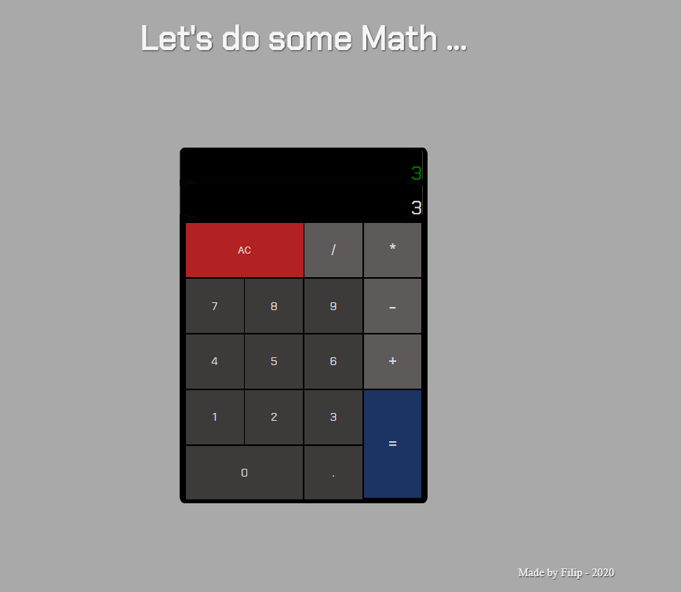

## JavaScript Calculator

#### A Front-End Project from **FreeCodeCamp** &nbsp; 

 

Still some little improvements to do for my personal goal but challenge is completed :

> **16 passed tests out of 16 !!** &nbsp; &nbsp; ( See here [The User Stories](https://www.freecodecamp.org/learn/front-end-libraries/front-end-libraries-projects/build-a-javascript-calculator) to follow )

 

 <https://codepen.io/filip76/pen/GRqeEyw>

